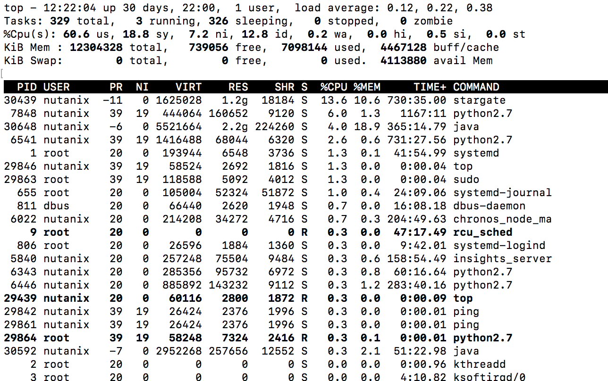
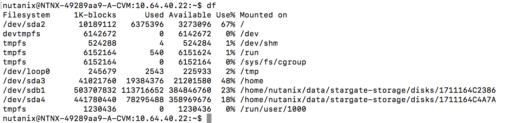
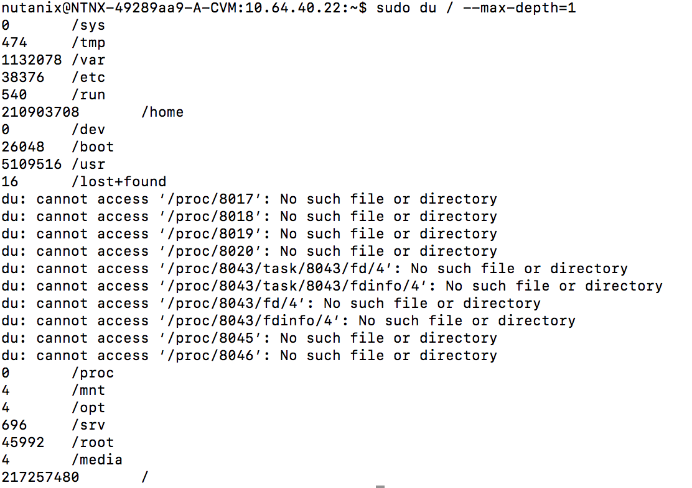
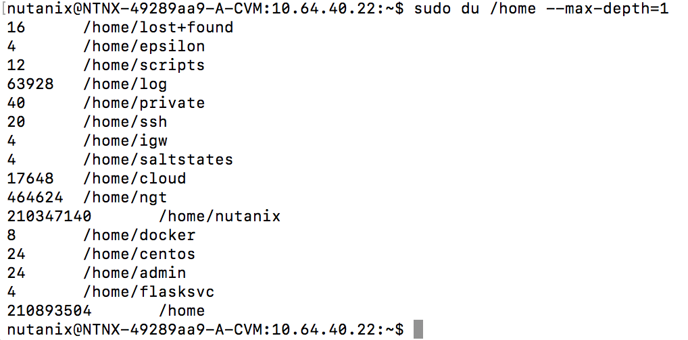
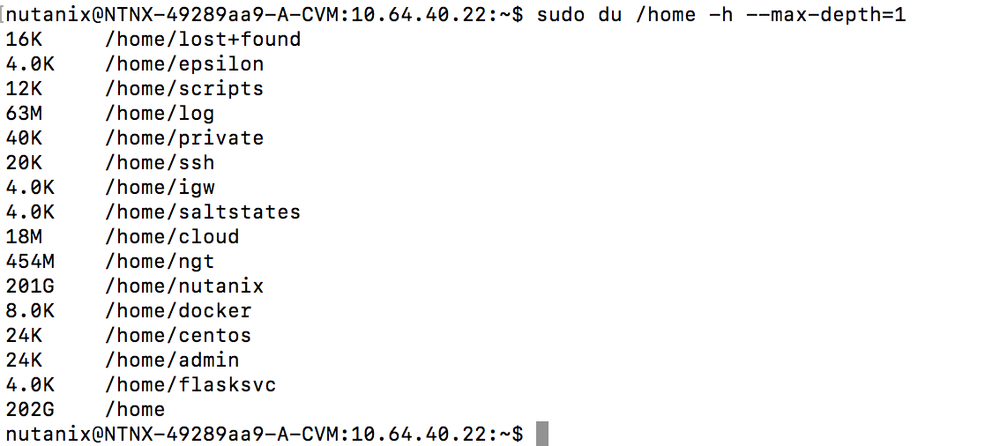
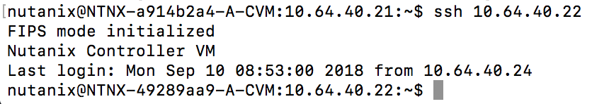

.. Adding labels to the beginning of your lab is helpful for linking to the lab from other pages
.. _basic_linux:

--------------------
Basic Linux Commands
--------------------

Overview
--------

As our Nutanix CVM is running within a CentOS O/S, we can use the default Linux bash commands to look, search and manipulate files. In this module you will learn the most common and handy commands to use.

- grep
- ls
- cat
- tr
- cut
- sar
- ifconfig
- less
- more
- find
- mv
- rm
- ps
- top
- tail
- df
- ssh

As this is just the list some usefull commands, a bigger list can be found at `this webpage <https://centoshelp.org/resources/commands/linux-system-commands/>`_ or just search for **bash commands**.

Commands
--------

For a total overview of the commands that can be helpfull use the following urls:

- For ls, help, grep, more and less use `this link <https://www.linkedin.com/learning/practical-linux-for-network-engineers-part-1/ls-help-man-grep-more-and-less?u=2006096>`_
- For general bash commands use `this link <https://ss64.com/bash/>`_

grep
....

The ``grep`` command can be used to:

- filter information from a file or command from its standard output using the **|** (pipe) sign
- search for a specific word in file(s)

**Lab 1**

Lab 1 is about filtering information using the output of a file. For this we are going to use the ``cat`` command.

- Login to the CVM using the IP address you have been assigned as user **nutanix**. The coressponding password is **nutanix/4u**.
  #. After the login was succesful type the following commands to go to the logs directory of the CVM.
    - ``cd /home/nutanix/data/logs`` instead of typing all, use the **tab key** to have the path automatically filled.
  #. run the following command to see which files are available ``ls -al``

ls
......

This ``ls`` command is the alterative to the ``dir`` command we might know form **DOS**. The command is to show (list) the files that are available in a specfic directory. Also some extra arguments will display for instance hidden files. Hidden files are files in Linux that begin with the **.** sign. To list these hidden files use ``ls -a`` . The ``-l`` argument (long) include owner of the file, size, date and time.

cat
...

The ``cat`` command show the content of a file.

ifconfig
........

``ifconfig`` is a way to get the IP information of the network cards. If the command is followed by a parameter ``-i eth0`` it only returns the IP configuration of the **eth0** NIC.

find
....

As the command ``find`` sugests you can search for file names through out the CVM or Linux based machines. To use this command
to find the hcl.json file you can use the following command ``find /* -name hcl*.json``. This will not lead to the required solution as the user that is logged in doesn't have enough rights to search all locations. The result shows, besides the to be search filename (hcl\*.json), also a lot of permission denied messages.

.. figure:: images/4.png

The better way would be ``sudo find /* -name hcl*.json``. The ``sudo`` command will run the command with **root** rights.

.. figure:: images/5.png


mv
...

This command makes it possible to move files within the linux based machines, but also rename filenames. So a rename must be done with the ``mv`` command in the bash world.

rm
...

``rm`` is a powerfull **AND** dangerous command. This will remove files, even based on wildcards, permantely from the machine. There will **not** be any warning!! It can be used to free up some space on the CVM if you run low on free space.

ps
...

This ``ps`` command is to show the process list. It can be used to see which processes are running and their PID (process ID number). To see if the genesis process is running, you can use the following combination of command: ``ps -ef | grep genesis``. If genesis is active, you will see some lines where genesis is mentioned.

.. figure:: images/6.png

.. note:: By the way if you don't get a few lines returned the changes are you have a typo or the CVM is not ready yet. Genesis is the mother of the CVM and starts as one of the first daemons on the CVM. Without genesis the CVM and therefore the cluster cannot start or the CVm cannot be connected into the cluster!.

top
...

This command can be used to see the load on the system and also shows which processes are consuming the resources. Below screeshot is an example of the command.




tail
....

``tail`` is a command that can be used to show the last lines of a file. By adding the **-n** argument and a numerical number you can see the last x lines from the file. An example would be ``tail -n 50`` to show the last 50 lines of the file.
Another very handy argument is the **-f**. This argument start to show the file, example is a log file, and as soon as a new line is being added to the bottom of the file, this file is shown. The **-f** is very helpfull in debugging issues like crashing daemons of the CVM or during the foundation process.

df
...

Free space is very important. Eventhough systems will warn at a certain level, having the possiblity to check that yourself is always handy. The ``df`` command provides this. An example is shown below.



du
...

If it seems that the ``df`` command is showing a high percentage on the **%Use** mark, it is interesting to find where that usage is. Here is where the ``du`` command comes into play. This command shows per directory the space that is being consumed.
To have the output usefull, as just ``du`` shows an enourmous amount of information, you can use the **--max-depth=** argument. This argument needs a numerical value. An example of the ``sudo du / --max-depth=1`` is shown below (sudo due to we want to see all directories).



This command will show the usages for all directories just below **/**. If for example you are intrested in the **/home** location use ``sudo du /home --max-depth=1`` to see two level down in the **/home** location.



The values that are being shown are based on KB in size. To have it more human readable use the -h argument in the commandline.
So ``sudo du /home --max-depth=1`` becomes ``sudo du /home -h --max-depth=1```. The output looks like




ssh
...

``ssh`` can be used to connect to other CVM or SSH enabled machines in the environment. An example would be to connect to another cvm to check some information. To connect to the other CVM use the following command: ``ssh 192.168.81.3``. Due to the fact that we are using the current loged in user on the CVM, nutanix, we will not be bothered by password as between the CVMs the authentication is certification based.




Caption text

------------------

Takeaways
---------

- Here is where we summarize any key takeaways from the module
- Such as how a Nutanix feature used in the lab delivers value
- Or highlighting a differentiator
