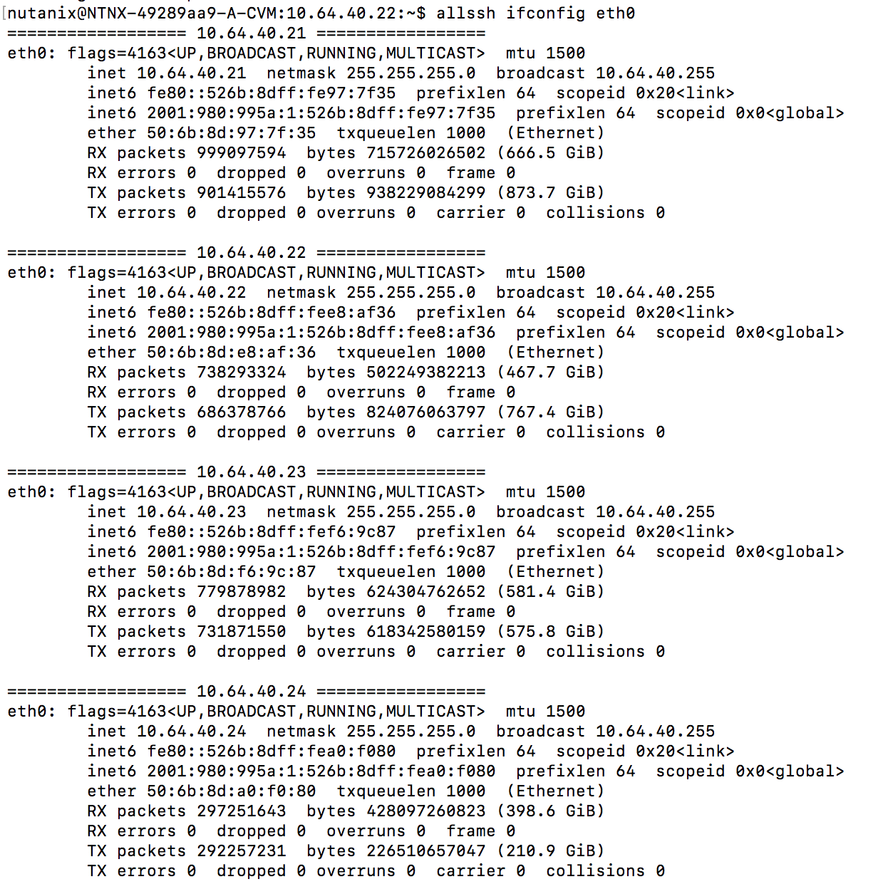

.. Adding labels to the beginning of your lab is helpful for linking to the lab from other pages
.. _example_lab_3:

-------------
CVM
-------------

Special CVM Commands
++++++++++++++++++++

allssh
------

If in a cluster you want to check some settings, or want to run a command on all CVMs, like ``ifconfig eth0`` you can also use the ``allssh`` command. This command is ONLY alvailable on a CVM. An example with the mentioned ``ifconfig eth0`` command would look like this: ``allssh ifconfig eth0``. The output is shown in the below screenshot.

Takeaways
+++++++++

- Here is where we summarize any key takeaways from the module
- Such as how a Nutanix feature used in the lab delivers value
- Or highlighting a differentiator
